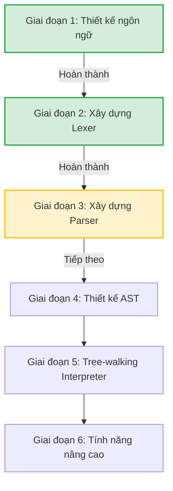

# 🗺️ Lộ trình Phát triển Ngôn ngữ Lập trình Nova (CPL)

Tài liệu này tóm tắt lộ trình thiết kế và phát triển ngôn ngữ lập trình **Nova (CPL)** dựa trên thiết kế cú pháp thực tế đã được chuẩn hóa.

---

## 1. Lộ trình Phát triển 6 Giai đoạn

Dưới đây là lộ trình chi tiết dành cho Nova (CPL):

### 🟩 Giai đoạn 1 — Thiết kế Ngôn ngữ (Hoàn thành)
* **Thời gian dự kiến**: 1-2 ngày.
* **Mục tiêu**: Xác định cú pháp, đặc tả ngữ pháp và tập tính năng cốt lõi (v1).
* **Kết quả thực tế**:
  - Đã thiết kế hoàn chỉnh hệ thống cú pháp song ngữ Anh - Việt.
  - Tài liệu đặc tả chi tiết từ `01_entry_point.md` đến `11_strings.md` trong thư mục `docs/`.
  - Quyết định loại bỏ cú pháp lai phức tạp `for-while`, tối giản hóa bằng **Range-based Loop** (`..`, `..=`, `đến`, `đến_hết`).

### 🟩 Giai đoạn 2 — Xây dựng Bộ phân tích từ vựng (Lexer) (Hoàn thành)
* **Thời gian dự kiến**: 3-5 ngày.
* **Mục tiêu**: Chuyển đổi mã nguồn dạng text thô thành danh sách các token có ý nghĩa.
* **Kết quả thực tế**:
  - Định nghĩa hoàn chỉnh enum [TokenType](file:///d:/Du_an_ca_nhan/Custom-Programming-Language/src/nova/lexer/TokenType.java) gồm hơn 50 loại token (bao gồm cả các từ khóa và toán tử mới như `function`/`hàm`, `in`/`từ`, `đến`/`đến_hết`, `khác`/`is_not`).
  - Triển khai lớp [Lexer](file:///d:/Du_an_ca_nhan/Custom-Programming-Language/src/nova/lexer/Lexer.java) xử lý đọc số, chuỗi, ký tự escape, toán tử hai ký tự và tự động chèn dấu chấm phẩy (`shouldInsertSemicolon`).
  - Hoàn thành bộ kiểm thử [VerifyAll](file:///d:/Du_an_ca_nhan/Custom-Programming-Language/src/verification/VerifyAll.java) quét thành công 100% cú pháp mẫu trong đặc tả.

### 🟨 Giai đoạn 3 — Xây dựng Bộ phân tích cú pháp (Parser) (Tiếp theo)
* **Thời gian dự kiến**: 1-2 tuần.
* **Mục tiêu**: Xây dựng thuật toán phân tích cú pháp để tổ chức danh sách token thành cây phân tích cú pháp (Parse Tree).
* **Nhiệm vụ trọng tâm**:
  1. Sử dụng kỹ thuật **Recursive Descent Parser** (Phân tích cú pháp đệ quy đi xuống) - mỗi quy tắc ngữ pháp (grammar rule) tương ứng với một phương thức trong mã nguồn Java.
  2. Xử lý độ ưu tiên của toán tử (Operator Precedence) bằng thuật toán **Pratt Parsing** hoặc phân cấp phương thức (nhân/chia trước, cộng/trừ sau).
  3. Phân tích các cấu trúc câu lệnh chính:
     - Khai báo biến và hằng (`var`, `const`).
     - Câu lệnh điều kiện (`if-else` / `nếu-không_thì`).
     - Khối lựa chọn (`switch-case` / `trường_hợp`).
     - Vòng lặp (`loop`, `for`).
     - Khai báo và gọi hàm (`function` / `hàm`).
  4. Quản lý lỗi cú pháp (Error reporting & recovery) để tiếp tục phân tích khi gặp lỗi thay vì dừng chương trình ngay lập tức.

### ⬜ Giai đoạn 4 — Thiết kế AST (Abstract Syntax Tree)
* **Thời gian dự kiến**: 3-5 ngày.
* **Mục tiêu**: Xây dựng mô hình cấu trúc cây trừu tượng biểu diễn ngữ nghĩa của chương trình sau khi phân tích cú pháp.
* **Nhiệm vụ trọng tâm**:
  1. Định nghĩa phân cấp các Node trong cây (Expression vs Statement) sử dụng tính năng **sealed classes** của Java 17+ nhằm tối ưu hóa tính an toàn kiểu dữ liệu.
  2. Triển khai **Visitor Pattern** giúp dễ dàng duyệt cây AST phục vụ cho việc thông dịch (Interpreter) và kiểm tra kiểu (Type Checker) sau này.
  3. Xây dựng bộ công cụ in cây AST trực quan (AST Pretty Printer) để phục vụ cho quá trình gỡ lỗi (Debugging).

### ⬜ Giai đoạn 5 — Bộ thông dịch Tree-Walking Interpreter
* **Thời gian dự kiến**: 2-3 tuần.
* **Mục tiêu**: Duyệt cây AST và thực thi trực tiếp các câu lệnh để cho ra kết quả chạy chương trình.
* **Nhiệm vụ trọng tâm**:
  1. Quản lý môi trường và tầm vực biến (Environment & Scope Management) bằng cấu trúc `HashMap` kết hợp con trỏ trỏ về môi trường cha (parent pointer) để hỗ trợ tầm vực lồng nhau (Lexical Scoping).
  2. Đánh giá biểu thức (Expression Evaluation) cho các phép toán số học, logic và so sánh.
  3. Thực thi hàm và bao đóng (Function calls & Closures) bằng cách tự quản lý Call Stack.
  4. Tích hợp sẵn một số hàm cốt lõi (Built-in functions) như in màn hình, đọc dữ liệu nhập vào (`print`, `input`, `length`).
  5. Xây dựng công cụ chạy tương tác dòng lệnh **REPL** (Read-Eval-Print Loop).

### ⬜ Giai đoạn 6 — Java Transpiler & Thư viện Interop (Giai đoạn 1 nâng cao)
* **Mục tiêu**: Biên dịch mã nguồn Nova sang mã nguồn Java gốc và tích hợp hệ sinh thái Java.
* **Nhiệm vụ trọng tâm**:
  - Hỗ trợ lập trình hướng đối tượng (OOP): Classes, kế thừa, thuộc tính và phương thức.
  - Bộ kiểm tra kiểu tĩnh (Static Type Checking) trước khi chạy.
  - Xây dựng **Java Transpiler**: Trình biên dịch dịch từ CPL sang mã nguồn Java (`.java`) sạch sẽ, tối ưu, sau đó gọi trình biên dịch `javac`.
  - Thực thi cơ chế **Java Interop Bridge** (gọi các lớp của JVM qua reflection).
  - Hoàn thiện bộ thư viện chuẩn song ngữ (Math, Regex, Logging, File I/O) và framework web mini (`nova.web`).

---

## 2. Giai đoạn 2: Biên dịch trực tiếp ra mã máy (AOT Native Compilation)

Sau khi hoàn thành 6 giai đoạn thử nghiệm trên nền JVM/Java, dự án sẽ chuyển dịch sang Giai đoạn 2 để tối ưu hóa hiệu năng và quản lý bộ nhớ cận phần cứng:

* **Pha 2.1 (AOT via C/C++ Transpiler):** Dịch mã nguồn CPL sang mã C/C++ hiện đại, dùng GCC/Clang để tạo file thực thi native. Pha này tập trung giải quyết và kiểm thử mô hình quản lý bộ nhớ tĩnh (Smart Pointers, Reference Counting) tương đương định hướng của Rust.
* **Pha 2.2 (LLVM Backend Compiler):** Xây dựng trình biên dịch chính thức sinh mã LLVM IR trực tiếp, tối ưu hóa triệt để hiệu suất để tạo ra một ngôn ngữ lập trình native độc lập hoàn toàn.

---

## 2. Tài liệu Tham khảo khuyên dùng
1. **Crafting Interpreters** (Robert Nystrom): Cuốn sách hướng dẫn thực hành tốt nhất, đặc biệt phần 1 (viết Tree-walking Interpreter bằng Java) khớp hoàn toàn với kiến trúc kỹ thuật của Nova.
2. **Writing An Interpreter In Go** (Thorsten Ball): Minh họa xuất sắc về cách viết Lexer/Parser bằng tay không dùng thư viện bổ trợ.
